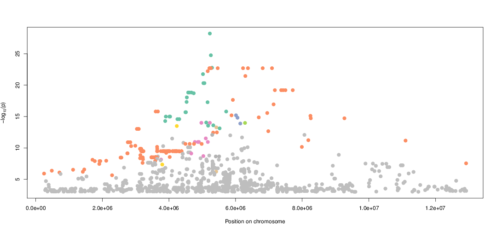

# LD-Blocks : plot LD blocks around an association signal

## Description

This script produces a single PDF image that represents LD-blocks in a given genomic region. It shows maximum 8 blocks, and plots preferentially the blocks that have a low association p-value.

## Usage

```
./ldblock.sh [assoc_file] [region] [p_value_threshold] [plink_file] [ld_threshold] [outfile]
```

* **`assoc_file`** : the association results file, should be bgzipped and tabixed
* **`region`** : the boundaries of the region to plot
* **`p_value_threshold`** : only plot p-values that fall below this threshold (`1e-3` usually works well)
* **`plink_file`** : a `plink` BED/BIM/FAM file base that contains genotypes for all the variants in `assoc_file`
* **`ld_threshold`** : use this LD threshold to determine inclusion in a block (`0.5` usually works well)
* **`outfile`** : the output file base name

## Dependencies

The script depends on `R` and `plink`. It contains a **Python 3** script which requires `pandas` and `numpy`.
